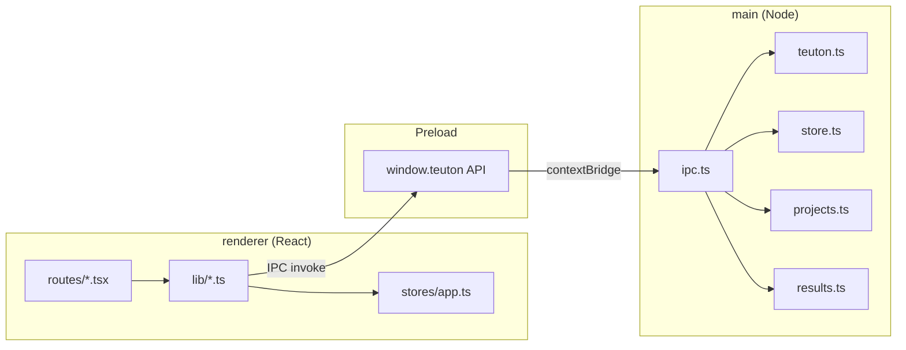
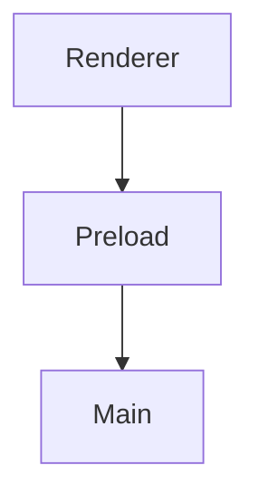

# Teutón GUI Review

Reviews changes to `teuton-gui-v2` with three parallel, non-overlapping agents. This is a
from-scratch skill (no earlier version to diff against) — see "Why this shape" at the bottom
for the reasoning behind each section.

## Flags

| Flag | Behavior |
|-|-|
| `--changed` | Default. Review only files changed since HEAD (`git diff --name-only HEAD`) |
| `--full` | Review the whole `src/` tree + the architecture diagram + health score |
| `--security-only` | Run the Security & Trust Boundary agent alone |
| `--debt` | Add tech-debt scoring, tighter thresholds, and extra checks to every agent |
| `--all` | `--full` + `--debt` combined (most thorough) |

Flags combine where logical (e.g. `--security-only --debt`).

## Preflight

Run first, always:

```bash
bash .claude/scripts/teuton-preflight.sh src
```

Outputs JSON keyed by check ID (`SEC-*`, `REG-*`, `EXC-*`, `DUP-*`, `DEAD-*`, `QUAL-*`,
`STYLE-*`). Split results by prefix and inject each group into the owning agent's
`PREFLIGHT KNOWN ISSUES` block: `SEC-*` → Security, `REG-*`/`EXC-*` → Reliability,
`DUP-*`/`DEAD-*`/`QUAL-*`/`STYLE-*` → Quality.

**Portability note:** the script uses only `grep`/`find`/`awk`/`python3`, deliberately never
`rg`. In this harness, `rg` (and `grep`, for that matter) is a shell *function* that proxies
through the Claude Code binary in an interactive shell — that function does not exist in a
script invoked as `bash file.sh`, where `rg` resolves to nothing and silently produces empty
results if guarded by `|| true`. Don't reintroduce `rg` into this script.

## Execution: 3 Parallel Sub-Agents

Launch all three in one batch — they have no cross-dependencies.

| Agent | Owns (checks these) | Does NOT check |
|-|-|-|
| **Security & Trust Boundary** | `contextIsolation`/CSP posture, subprocess/spawn/execFile safety (shell:true, string interpolation, missing args-array), path/filename sanitization, credentials/secrets, `shell.openExternal`/`will-navigate` allowlist enforcement | error-handling structure, IPC wiring, dead code, React patterns |
| **Domain Reliability & Wiring** | the CLAUDE.md-documented invariants (see below), the 4-file IPC contract (`shared/ipc.ts` ↔ `main/ipc.ts` ↔ `preload/index.ts` ↔ `shared/types.ts`), swallowed-error data loss, resource cleanup (timers, listeners) | injection/secrets content, type modernization, dead code, duplication |
| **Quality (TS/React)** | type safety, dead code/unused deps, duplication, file size/complexity, React hook correctness, i18n consistency (`i18n/es.ts`) | IPC wiring, domain invariants, security |

If `--security-only` is set, run only the Security agent.

### Domain Reliability & Wiring: the invariants to verify

CLAUDE.md documents these explicitly; a change that breaks one of them is usually a silent
bug, not a crash, so they need a human/agent check, not just a type-checker:

1. **Monitor-loop chaining** (`lib/run.ts`): every path that ends a run cycle while
   "modo examen" is active — normal exit (`loadAfterExit`), cancellation (`cancelRun`), both
   startup-failure branches in `startRun` — must call `scheduleNextCycle`. The invariant is
   `monitor.active ⇒ a next cycle is scheduled`. A new early-return in any of these paths that
   forgets this call makes the monitor silently die while still showing "active".
2. **Best-grade-record scoping** (`main/store.ts` `getRecords`/`updateRecords`/`resetRecords`):
   merges are always `Math.max`, never overwrite; records are keyed by `class:<rosterId>` (or
   `manual`), and two classes must never cross-contaminate. `reloadLatestResults()` must use
   the class that *produced* the run (frozen in `.teuton-gui-meta.json` as `lastRunClassId`),
   not whatever class happens to be active in the UI right now.
3. **Config colon-symbol round-trip** (`lib/config.ts`): `parseConfig`/`stringifyConfig` must
   keep normalizing `:tt_members`-style Ruby-symbol keys on read and writing back in modern
   (no-colon) style, and any section the UI doesn't edit (`alias`, `macros`, `tt_include`, …)
   must still round-trip byte-for-byte via `extra`.
4. **Draft-vs-disk consistency** (`lib/run.ts` `startRun`): must call `saveDraftsIfDirty()`
   before invoking `teuton run`, since the CLI reads from disk, not the in-memory draft.
5. **Live-progress regex scoping** (`lib/progress.ts` `computeLiveProgress`): the `.`/`F`/`S`
   match must stay scoped to the region between "Started at" and "Finished in", and the
   `==>` sequential-mode marker line must be stripped first — a widened match window can
   false-positive on grade values like "100.0".
6. **Per-class Moodle CSV suffixing** (`main/store.ts` `writeClassCsv`): must keep writing
   `moodle-<clase>-<id8>.csv` and deleting any stale un-suffixed `moodle-<clase>.csv`, so a
   teacher can't upload an outdated file.
7. **PATH/gem-bin caching** (`main/teuton.ts`): `teutonEnv`/`resolveTeuton` cache results in
   module-level variables; any change here must keep `resetTeutonCache()` wired to the
   "recheck" UI action (`Settings.tsx`), or a newly-installed `teuton` won't be picked up
   without an app restart.
8. **`runId` event matching** (`lib/run.ts` `useRunManager`): events whose `runId` doesn't
   match the active run must be dropped — this is what makes a cancelled process's `close`
   event a no-op instead of corrupting the dashboard.

### Domain Reliability & Wiring: the 4-file IPC contract

Every entry in `shared/ipc.ts`'s `IPC` map must have: an `ipcMain.handle(IPC.<key>, ...)` in
`main/ipc.ts`, a reference somewhere in `preload/index.ts`, and — since preload's exposed
`api` object and `TeutonApi` are meant to match name-for-name — a matching method in
`shared/types.ts`'s `TeutonApi` interface. `REG-01` in the preflight script checks this
automatically. **Known exception, not a bug:** the exposed method name doesn't have to match
the `IPC` map's key name — `runStart` (channel key) is exposed as `run()`, and `runCancel` is
exposed as `cancelRun()`. Don't flag a naming mismatch there; only flag a channel that's
genuinely unreferenced anywhere in `preload/index.ts`.

## Context Awareness (DO NOT flag)

These patterns are correct in THIS project. Agents must not flag them:

- **Silent catch-with-fallback on reads** is the deliberate convention for optional persisted
  JSON state (`readJson<T>(name, fallback)` in `main/store.ts`, `dirExists`/`fileExists`
  helpers, `getProjectMeta`, `getRecords`): a missing or unparseable file just means "use
  defaults", not an error to surface. **Do** still flag the narrower case where a *write*
  (not a read) is swallowed by an equally-empty catch with no re-throw and no UI-visible
  error — see `EXC-01` below, which is a real, separate risk.
- **Type assertions (`as Record<string, unknown>`, etc.)** throughout `main/results.ts`,
  `main/store.ts`, `lib/config.ts` are boundary-parsing of untyped JSON/YAML coming from the
  external `teuton` CLI or from disk — not corner-cutting. The project has zero `any`, zero
  non-null assertions (`!`), and zero `@ts-ignore` anywhere; `strict: true` is on in both
  `tsconfig.web.json` and `tsconfig.node.json`. Treat any *new* `any`/`!`/`@ts-ignore` as a
  real regression, but don't ask for stronger typing on the existing CLI/YAML boundary casts.
- **`spawnRun` (`main/teuton.ts`) intentionally has no timeout** — it's a long-running,
  user-cancelable streaming process (`teuton run`), not a bounded call. `runTeutonSync` calls
  (`check`, `exportAs`, `createProject`) do all pass explicit timeouts; that's the pattern to
  check for, not spawnRun.
- **Native `window.prompt`/`window.confirm`** (`ConfigTable.tsx`, `Classes.tsx`,
  `Dashboard.tsx`) are acceptable here — this is a local, single-user desktop tool, not a
  public web app; don't flag them as a UX or web-security anti-pattern.
- **The `usuario`/`usuario` seeded default credential** appears in four places by design:
  `main/projects.ts` `SKELETON_CONFIG`, `main/store.ts` `DEFAULT_GLOBALS`,
  `renderer/src/stores/app.ts`'s initial `defaultGlobals` state, and a doc comment in
  `shared/types.ts`. This is the documented "students' machines share one login" seed, not a
  leaked credential — `SEC-04` in preflight will surface these; dismiss them.
- **`console.log`/`console.debug`, `any`, non-null assertions**: none currently exist in the
  codebase. If a diff introduces one, that's a real regression to flag, not noise.

## Debt Scoring (--debt / --all only)

| Severity | Points |
|-|-|
| Critical | 8 |
| High | 4 |
| Medium | 2 |
| Low | 1 |

### Score Breakdown
| Agent | Critical | High | Medium | Low | Score |
|-|-|-|-|-|-|
| Security | X | X | X | X | X |
| Reliability | X | X | X | X | X |
| Quality | X | X | X | X | X |
| **Total** | X | X | X | X | **X/100** |

Bands: 0 pristine · 25 healthy · 50 needs attention · 75+ stop and fix.

`--debt` also tightens thresholds: `QUAL-01`'s file-length flag drops from 400 to 300 lines,
and any `warn`-level preflight finding (SEC-03, SEC-04, EXC-01, EXC-02, DUP-01, DEAD-01)
escalates to at least Medium severity instead of being freely dismissible.

### Auto-Fixable
**Safe (no logic change):**
- Remove an unused `package.json` dependency once confirmed unused (`DEAD-01`).
- Delete an `eslint-disable` comment once confirmed there's no eslint config (`STYLE-01`).

**Needs confirmation (behavior may change):**
- Extracting the duplicated filename-sanitizer regex into a `shared/` helper (`DUP-01`) —
  needs a decision on whether main/renderer should share a `shared/sanitize.ts` module.
- Narrowing a swallowed write-error catch to re-throw or surface to the UI (`EXC-01`) — needs
  a decision on what the teacher should see when a grade-record write fails.

## `--full` Mode: Architecture

Only when `--full` or `--all` is set.





Flag any renderer code that reaches into `node:*`/`electron` main-process APIs directly
(bypassing `window.teuton`) as a Critical layer violation — that would defeat
`contextIsolation`.

### Architecture Health Score: X/100
| Check | Weight | Scoring |
|-|-|-|
| IPC 4-file contract intact (REG-01) | 30 | -10 per drifted channel |
| No renderer→main direct access bypassing preload | 25 | -25 per violation (this is load-bearing for the security model) |
| Documented invariants (1-8 above) still hold | 30 | -5 per broken invariant |
| File organization / no oversized files | 15 | -3 per file over threshold |

## Post-Flight Reconciliation

After all agents return:

1. **DEDUP**: same file:line from multiple agents → keep the one from the owning agent per
   the Owns/Does-NOT-check table above.
2. **PREFLIGHT CHECK**: every preflight finding (SEC-*/REG-*/EXC-*/DUP-*/DEAD-*/QUAL-*/STYLE-*)
   must appear in an agent report as either Confirmed (with fix) or Dismissed (with a
   specific reason — check the Context Awareness list first). A preflight finding missing
   from all reports was dropped; flag it.
3. **COMPLETENESS**: reject findings missing file:line, current code, proposed fix, why, or
   intent-ruled-out.
4. **SEVERITY GATE**: Critical = exploitable trust-boundary bypass or silent grade-data loss;
   High = broken domain invariant (section above) or missing IPC wiring; Medium = dead
   code/duplication/type gaps; Low = style/naming.

## Output Format

```markdown
# Teutón GUI Review Report
**Target:** [X files: scope description]
**Date:** [timestamp]
**Preflight:** [X checks run, Y findings fed to agents]

## Summary
| Severity | Count |
|-|-|
| Critical | X |
| High | X |
| Medium | X |
| Low | X |

## Critical Issues (Fix Before Merge)
| # | Agent | File:Line | Current Code | Proposed Fix | Why | Intent Ruled Out |
|-|-|-|-|-|-|-|

## High Priority
| # | Agent | File:Line | Current Code | Proposed Fix | Why | Intent Ruled Out |
|-|-|-|-|-|-|-|

## Medium Priority
| # | Agent | File:Line | Current Code | Proposed Fix | Why | Intent Ruled Out |
|-|-|-|-|-|-|-|

## Low Priority
[Summary count by category, not individual rows]

## Preflight Reconciliation
| Check ID | Status | Agent | Verdict |
|-|-|-|-|

## Auto-Fixable Issues
**Safe:** / **Needs confirmation:**

## Recommended Fix Order
1. ...
```

**Agent output rules:**
- Under 3000 characters per agent.
- Every finding: File:Line | Current Code | Proposed Fix | Why | Intent Ruled Out.
- Intent Ruled Out: name the evidence this is not deliberate (adjacent comment, sibling doing
  the same, an entry in the Context Awareness list above). If you can't find it, say
  `intent-unverified` instead of asserting a defect.
- If you can't fill all 5 fields, investigate more or drop the finding.
- Don't list Low-severity items individually — summarize by category.
- End with: `FINDINGS: X critical, X high, X medium, X low`

## Capture Findings for Self-Learning (MANDATORY)

After reconciliation, append every CONFIRMED finding (all severities, including INFO) to
`.claude/reviews/review-issues.jsonl` via `.claude/scripts/capture-finding.sh`. This feeds
`/a-self-learner` so recurring issues harden this skill and `.claude/rules/` over time.
Whitelisted/dismissed findings are NOT captured — they go to the Context Awareness list above
instead.

Generate one `RUN_ID` per review run (e.g. `r-20260730-1430`); reuse it for every finding:

```bash
bash .claude/scripts/capture-finding.sh \
  --project teuton-gui-v2 --skill teuton-review --run-id "$RUN_ID" \
  --dimension <security|architecture|quality> \
  --severity <critical|high|medium|low|info> \
  --category <stable-slug> \
  --file <repo-relative-path> --line <n> \
  --message "<one-line description>" \
  [--fix "<proposed fix>"] [--agent <agent>] [--check-id <preflight id>]
```

### Category slugs

Reuse an existing slug for the same class of issue — this is the clustering key
`a-self-learner` groups on. Seeded from generic patterns plus this project's own:

| Pattern | Slug |
|-|-|
| IPC channel defined but missing from one of the 4 contract files | `ipc-channel-drift` |
| Write wrapped in a catch that swallows all errors, not just the documented case | `swallowed-write-error` |
| Same sanitizer/normalizer logic duplicated across main/renderer | `duplicate-sanitizer-logic` |
| Declared npm dependency never imported | `unused-dependency` |
| `eslint-disable` comment with no eslint config in the repo | `stale-eslint-disable` |
| One of the 8 documented domain invariants broken by a change | `domain-invariant-broken` |
| Renderer code reaching `node:*`/`electron` directly, bypassing preload | `contextisolation-bypass` |
| `subprocess`/`spawn`/`execFile` with `shell: true` | `shell-injection-risk` |
| Timer (`setInterval`/`setTimeout`) scheduled with no matching clear path | `unmanaged-timer` |
| Hardcoded credential-shaped literal outside the documented seed convention | `hardcoded-secret` |
| Dead code / unreachable branch | `dead-code` |
| File exceeds the project's length threshold | `file-too-long` |
| Type modernization opportunity (new — currently zero instances) | `stringly-typed-value` |

## Rule Candidates

A finding is a rule candidate when: the same issue appears in 3+ locations, OR it reflects
an undocumented project convention, OR the fix needs knowledge not obvious from the code.
Check `.claude/rules/` and `CLAUDE.md` first; if not already covered, propose adding it. Ask
before adding — never write a rule silently.

| Pattern | Occurrences | Proposed Rule | Target File | Status |
|-|-|-|-|-|
| Filename-sanitizer regex duplicated across the process boundary | 2 (main/store.ts, Dashboard.tsx) | Extract cross-boundary helpers to `shared/` instead of duplicating | `CLAUDE.md` | **Applied 2026-07-30**: extracted to `src/shared/sanitize.ts` (`sanitizeFileName`), both call sites updated, and the `src/shared/` description in CLAUDE.md's Architecture section now states the convention |
| IPC method-name exceptions (`runStart`→`run`, `runCancel`→`cancelRun`) | 2 | Document that channel-map keys and exposed method names are allowed to differ, so a future contributor doesn't "fix" the naming | `CLAUDE.md` | **Applied 2026-07-30**: documented inline in the `src/shared/` bullet of CLAUDE.md's Architecture section |

Both candidates above have been applied — kept in the table (rather than deleted) so a
future optimizer run can see they were already acted on instead of re-proposing them.

---

## Why this shape (not shown to the user on each run)

Built from scratch on 2026-07-30: no `.claude/skills/` existed in this project before. The
codebase is small (~6,200 lines, 36 files) and unusually well-documented — `CLAUDE.md`
already spells out 8 non-obvious invariants and the full security posture. Given that, the
highest-value review isn't generic OWASP/quality boilerplate; it's making sure every diff
still honors what CLAUDE.md already promises, plus the mechanical IPC-contract check that
CLAUDE.md explicitly flags as an easy-to-forget maintenance step. Three agents (not more) was
enough to cover the project's real dimensions without fragmenting scope. `--debt`/`--full`
were kept lightweight (one real layered boundary — the IPC process split — not a deep MVC
stack) rather than skipped outright, since the capability checklist calls for them and they
do map onto something real here.
