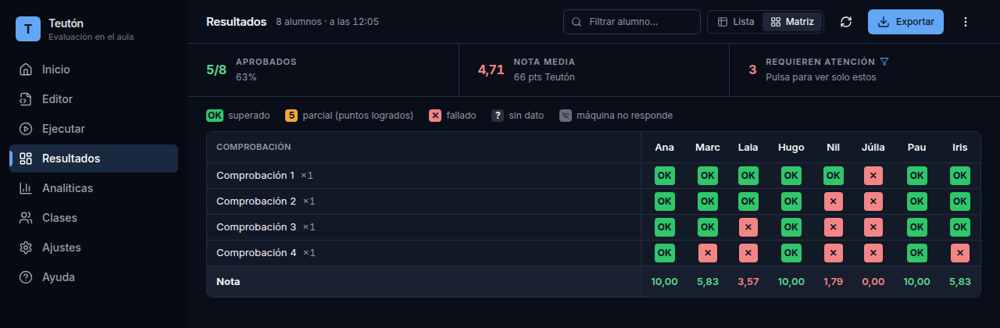
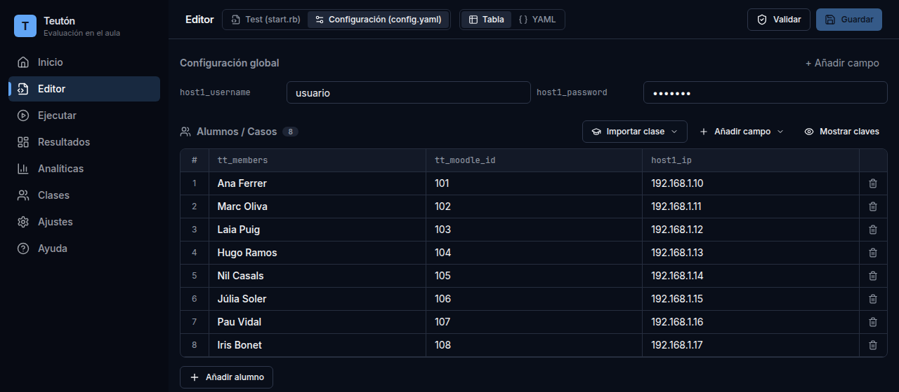
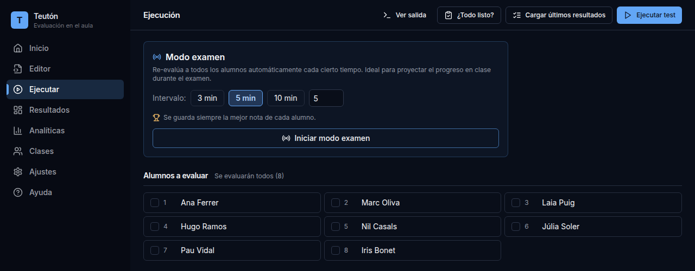
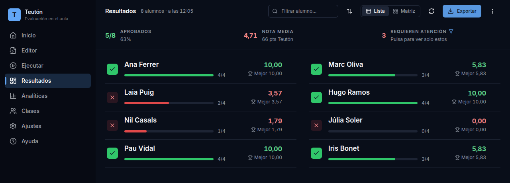
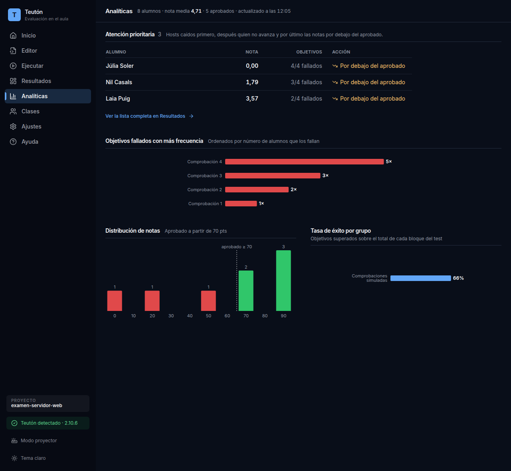

<div align="center">

# Teutón GUI

**Corrige las prácticas de toda una clase a la vez, y proyecta el resultado en directo.**

Aplicación de escritorio para Linux que pone pantalla a **[Teutón](https://github.com/teuton-software/teuton)**,
el corrector automático de infraestructura.



</div>

---

## ¿Qué es esto?

Imagina un examen de servicios en red: veinte alumnos, cada uno con su máquina, y hay que comprobar si el
servidor web arranca, si el cortafuegos está abierto, si el usuario existe. Ir máquina por máquina es
imposible en una hora de clase.

**Teutón** hace esas comprobaciones solo, por SSH, y pone nota. **Teutón GUI** es la pantalla desde la que
lo manejas: apuntas los alumnos en una tabla, le das a ejecutar, y ves quién va bien y quién está
atascado. Sin abrir una terminal.

Está pensada para usarse **durante** el examen, proyectada en clase, no solo para corregir al acabar.

## ¿Y qué es Teutón?

[**Teutón**](https://github.com/teuton-software/teuton) es el motor que hace todo el trabajo de verdad: se
conecta a las máquinas, lanza las comprobaciones que tú has escrito y calcula la nota. Es una gema de Ruby,
software libre, creada por **David Vargas Ruiz** y sus colaboradores.

> Esta aplicación **no es** Teutón. Es una interfaz independiente construida encima. Todo el mérito del
> motor de evaluación es de [teuton-software/teuton](https://github.com/teuton-software/teuton).
>
> La GUI no reimplementa nada de la corrección: llama al programa `teuton` y muestra lo que este responde.

Si Teutón te resulta útil, el repositorio que hay que estrellar es el suyo.

## Instalación en Ubuntu

Vale cualquier distribución basada en Ubuntu (Linux Mint, Pop!\_OS, Zorin…).

**1. Instala Teutón**, que es el motor. Necesita Ruby:

```bash
sudo apt install ruby
gem install teuton
```

**2. Descarga la aplicación.** Ve a la [última versión](https://github.com/adr1mt/teuton-gui/releases/latest)
y descarga el fichero que acaba en **`.AppImage`**.

**3. Dale permiso para ejecutarse.** Clic derecho sobre el fichero → *Propiedades* → *Permisos* → marca
**«Permitir ejecutar el archivo como un programa»**. Luego ábrelo con doble clic.

Guárdalo en una carpeta tuya (por ejemplo `Documentos` o el Escritorio), **no** en una carpeta del sistema:
la aplicación necesita poder reescribirse a sí misma para actualizarse.

<details>
<summary>Prefiero hacerlo desde la terminal</summary>

```bash
chmod +x Teuton-GUI-*.AppImage
./Teuton-GUI-*.AppImage
```

También hay un paquete `.deb` en la misma página, si prefieres que quede instalado en el menú de
aplicaciones. Ese **no** se actualiza solo: para cambiar de versión hay que descargar el `.deb` nuevo.

</details>

## Se mantiene actualizada sola

No hay que hacer nada. Cada vez que abres la aplicación, mira si hay una versión nueva y se la descarga
en segundo plano. Verás un aviso:

> Hay una versión nueva de Teutón GUI (1.1.1). Se instalará sola al cerrar la aplicación.

La actualización se aplica **al cerrar**, nunca mientras estás trabajando. Y si el **modo examen** está
activo, ni siquiera comprueba si la hay: durante un examen la conexión es para las máquinas de los alumnos.

Esto solo funciona con el `.AppImage`, y solo si está guardado en una carpeta donde tengas permiso de
escritura.

## Cómo se usa

### 1. Apunta a tu alumnado

El examen es una carpeta con dos ficheros: `start.rb` (qué se comprueba) y `config.yaml` (a quién).
La tabla es ese segundo fichero: una fila por alumno, con su identificador de Moodle y la IP de su máquina.

Si ya tienes el grupo guardado en **Clases**, lo traes entero con **Importar clase**. Los grupos se crean
en segundos pegando tres columnas desde una hoja de cálculo: nombre, correo e IP.



### 2. Lanza la corrección

**¿Todo listo?** revisa de antemano lo que suele fallar: que Teutón esté instalado, que el fichero no tenga
errores, que no falte ninguna IP. Mejor descubrirlo antes que con la clase sentada.

**Modo examen** repite la corrección cada pocos minutos, sola, hasta que la pares. Es lo que se proyecta en
clase: cada alumno ve su nota subir según va resolviendo.



### 3. Mira quién necesita ayuda

Cada alumno, su nota y cuántas comprobaciones ha superado. Un aviso aparte marca a quien tiene **la máquina
apagada o sin red**, que desde fuera se parece mucho a quien no ha hecho nada, pero necesita justo lo
contrario.



La vista **Matriz** lo enseña todo de un vistazo: una fila por comprobación, una columna por alumno. Si una
fila está roja entera, el problema no es de nadie en particular: es del enunciado.

### 4. Pon las notas

Las **Analíticas** dicen a quién hay que atender primero, qué comprobación falla más gente y cómo se
reparten las notas del grupo.



Al acabar, **Exportar** genera el CSV que Moodle importa tal cual.

> La aplicación lleva dentro un apartado de **Ayuda** con el manual completo, por si te pierdes en algún
> paso.

## Detalles que importan en un examen de verdad

- **Se guarda siempre la mejor nota de cada alumno.** Quien termina con un 10 y apaga la máquina no pierde
  el 10 porque la pasada siguiente ya no le encuentre.
- **La nota es tuya.** Teutón puntúa sobre 100; tú decides la escala («70 puntos = un 5»).
- **Un grupo no pisa a otro.** El mismo examen se puede pasar a varias clases: cada una lleva su historial
  y su propio CSV, aunque dos alumnos de grupos distintos se llamen igual.
- **Copias de seguridad de las notas cada hora**, fuera de la carpeta del examen. Si borras el proyecto o
  reinicias el historial por error, se recuperan.
- **Modo proyector**: agranda la letra y **tapa las IPs y las contraseñas** antes de enchufar el cañón.
- **El ordenador no se suspende** mientras el modo examen está activo.

## Para desarrolladores

Electron + React + TypeScript. La aplicación nunca reimplementa la lógica de Teutón: lanza el CLI y lee los
JSON que este exporta.

```bash
npm install
npm run dev          # desarrollo con recarga en caliente
npm test             # tests unitarios
npm run test:e2e     # UAT sobre la app real (necesita DISPLAY)
npm run dist:linux   # AppImage + .deb en dist/
```

| Documento | Contiene |
|---|---|
| [`CLAUDE.md`](CLAUDE.md) | Arquitectura y los mecanismos no evidentes, uno por uno |
| [`docs/PRODUCT.md`](docs/PRODUCT.md) | Para qué es la aplicación y para quién |
| [`docs/DESIGN.md`](docs/DESIGN.md) | Decisiones de interfaz y sistema visual |
| [`docs/UAT.md`](docs/UAT.md) | Los ataques que la suite hostil automatiza |

Publicar una versión: subir `version` en `package.json`, commitear y empujar el tag `v<esa versión>`.
GitHub Actions compila, pasa los tests y publica la release que reciben los demás.

Para ver las pantallas con datos sin montar máquinas virtuales, `node scripts/make-demo-project.mjs`
escribe en `sandbox/examen-demo/` un cuestionario de redes con 15 alumnos inventados y notas repartidas a
propósito; se abre desde Inicio y no necesita SSH.

Las capturas de este README se regeneran con `node scripts/capturas.mjs` (también con alumnos inventados).

## Créditos y licencia

- **Teutón**, el motor de evaluación — David Vargas Ruiz y colaboradores ·
  [teuton-software/teuton](https://github.com/teuton-software/teuton) · MPL-2.0
- **Teutón GUI**, esta interfaz — Adrià Muñoz, profesor de informática en el Institut El Puig

Publicada bajo [**MPL-2.0**](LICENSE), la misma licencia que Teutón, en señal de respeto y continuidad.
